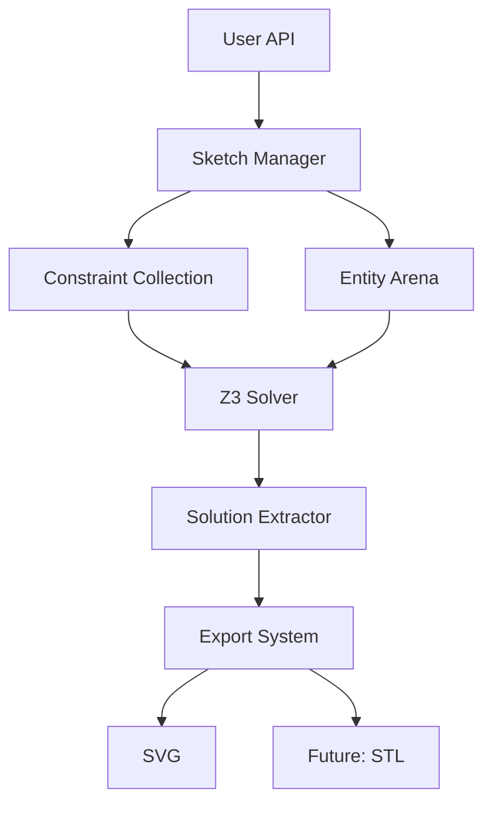
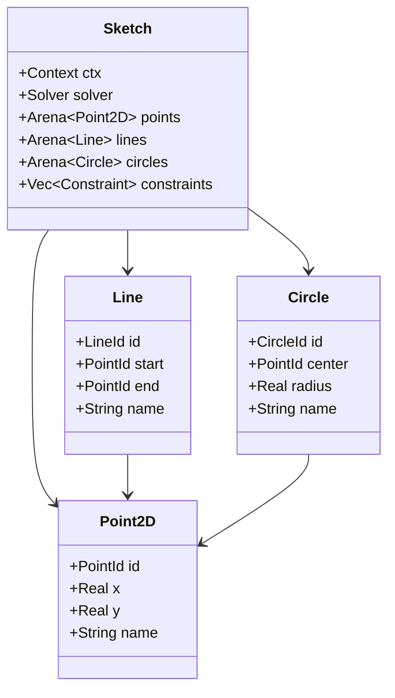
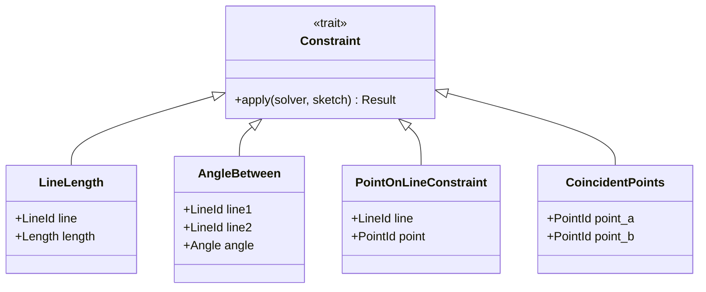
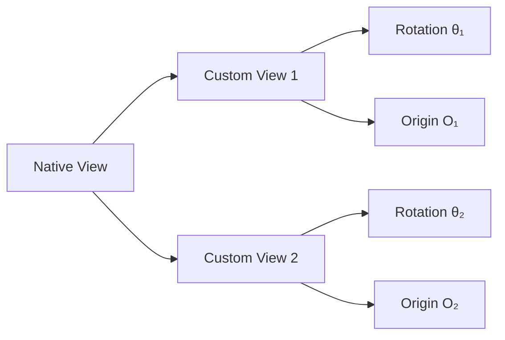

# TextCAD Architecture Specification

## 1. Requirements

### 1.1 Functional Requirements

**REQ-1: SI Unit System**
The system shall support SI units as the foundation for all measurements, ensuring consistency and precision in geometric calculations. The implementation must prevent unit mixing errors and provide clear conversion mechanisms between common unit scales such as meters, millimeters, and centimeters.

**REQ-2: 2D Geometric Primitives**
The system shall support fundamental 2D geometric primitives including points, lines, circles, circular arcs, and Bézier curves. These primitives form the building blocks for more complex geometric constructions and must be composable through the constraint system.

**REQ-3: Auxiliary Geometric Types**
The system shall provide auxiliary types including vectors, rays, planar regions, and angles to facilitate the definition of spatial relationships and constraints. These types serve as building blocks for expressing geometric relationships without necessarily appearing in the final output.

**REQ-4: Constraint Solving**
The system shall actively solve constraint systems rather than merely validating them. The solver must determine concrete geometric configurations that satisfy all specified constraints, potentially with multiple valid solutions that can be disambiguated through additional constraints.

**REQ-5: Multi-Parameter Object Definition**
Each geometric object shall expose multiple parameters through which it can be defined or queried. For example, a line shall provide access to its endpoints, length, direction vector, midpoint, and the set of all points lying on the line. This multiplicity enables flexible constraint specification.

**REQ-6: Native and Custom Views**
Each 2D sketch shall possess a native view that defines the canonical orientation including top, bottom, left, right, and zero axes. The system shall additionally support custom views with arbitrary rotations relative to the native view, enabling view-dependent constraint specification and queries.

**REQ-7: View-Based Spatial Queries**
The system shall support spatial queries relative to any defined view, such as identifying the topmost point from a set or filtering points based on their relative positions. These queries enable constraints like "point A shall be to the right of point B" expressed in a specific view's coordinate system.

**REQ-8: View-Based Constraints**
The system shall allow constraints to be defined relative to specific views. Examples include specifying that a line is horizontal or vertical in a particular view, or that one point lies above or to the right of another point according to a view's orientation.

**REQ-9: SVG Export**
The system shall export solved geometric configurations to SVG format, providing a visual representation of the constraint solution. The export functionality must handle coordinate system transformations and scaling appropriately.

**REQ-10: Planned 3D Support**
The architecture shall be designed with future 3D geometry support in mind, including eventual STL export capability. While the initial implementation focuses on 2D, design decisions should not preclude efficient extension to three dimensions.

### 1.2 Non-Functional Requirements

**REQ-11: Static Geometry**
Once a geometric configuration is fully described by constraints, both the geometry and the constraints shall be immutable. This immutability enables optimization and ensures consistency throughout the solving process.

**REQ-12: Declarative Constraint API**
The system shall provide a declarative API for constraint specification where geometric objects serve as constraint factories. Users should express what relationships hold rather than how to compute them, with the solver determining the concrete values.

**REQ-13: Type Safety**
The system shall leverage Rust's type system to prevent common errors at compile time where practical. This includes preventing unit mixing, ensuring valid entity references, and catching constraint specification errors early.

**REQ-14: Performance**
The constraint solver shall handle typical CAD sketches with dozens of geometric entities and constraints within reasonable time bounds (seconds rather than minutes). The architecture should support future optimization without fundamental redesign.

**REQ-15: Extensibility**
The system architecture shall be extensible to accommodate new geometric primitive types, constraint types, and solver backends without requiring modifications to core abstractions.

## 2. Design Concept

### 2.1 Overall Architecture

The TextCAD system employs a constraint-based parametric design approach where geometric entities are represented as collections of variables, and geometric relationships are expressed as constraints over these variables. The system delegates constraint solving to the Z3 theorem prover, which determines concrete values satisfying all constraints. This separation between constraint specification and constraint solving enables a clean, declarative API while leveraging industrial-strength satisfiability technology.

*derives from: REQ-4, REQ-12*

The architecture consists of several key layers. The user-facing API provides both a functional interface for constraint specification and an optional fluent chaining interface for ergonomic entity creation. The sketch manager maintains collections of geometric entities stored in memory arenas and accumulated constraints represented as trait objects. The constraint solver interface translates high-level geometric constraints into Z3's logical formula language, invokes the solver, and extracts concrete numeric solutions. Finally, the export system transforms solved geometric configurations into various output formats.

*derives from: REQ-12, REQ-15*

### 2.2 Entity Management

Geometric entities are stored in generational arenas, which provide stable identifiers that can be safely copied and referenced without Rust lifetime annotations. Each entity type such as Point2D, Line, or Circle maintains its own arena within the sketch. Entity identifiers are strongly typed, preventing confusion between different entity types at compile time.

*derives from: REQ-13, REQ-15*

Each geometric entity consists primarily of Z3 Real variables representing its degrees of freedom. For example, a Point2D contains two Real variables for its x and y coordinates, while a Line references two Point2D entities for its endpoints. This representation allows Z3 to treat geometric coordinates as unknowns to be solved rather than fixed values.

*derives from: REQ-4, REQ-11*

### 2.3 Constraint System

Constraints are represented as trait objects implementing a common Constraint trait. Each constraint type knows how to translate itself into Z3 assertions over the variables of the entities it constrains. The sketch accumulates constraints as users specify geometric relationships, then applies all constraints to the solver when solution is requested.

*derives from: REQ-4, REQ-12, REQ-15*

The constraint application process translates high-level geometric concepts into algebraic equations. For instance, a length constraint generates an equation stating that the squared distance between endpoints equals the squared target length. Angle constraints employ the unit circle method, introducing normalized direction vectors and expressing angular relationships through dot and cross products. This approach avoids transcendental functions while maintaining exactness for common angles.

*derives from: REQ-4, REQ-5*

### 2.4 Parametric Sets and Constraint Factories

Geometric entities serve as constraint factories through methods that generate appropriate constraint objects. When a user calls line.contains_point(point_id), the line does not immediately modify the point's coordinates. Instead, it returns a PointOnLineConstraint object that, when added to the sketch, will ensure the solver finds coordinates placing the point on the line. This pattern maintains the declarative nature of the API while hiding implementation details.

*derives from: REQ-5, REQ-12*

The constraint generated by contains_point internally introduces a parameter variable t representing position along the line. The constraint asserts that the point's coordinates equal the line's start point plus t times the direction vector, with t bounded between zero and one. Users need not manage these parameter variables explicitly; they emerge naturally from the constraint application process.

*derives from: REQ-5, REQ-12*

### 2.5 View System

Views represent coordinate systems with specified origins and rotations. The native view of a sketch defines the canonical orientation where positive x points right and positive y points up. Custom views can be defined with arbitrary rotations and origins relative to the native view. Each view provides transformation methods to convert between global coordinates and view-local coordinates.

*derives from: REQ-6, REQ-7, REQ-8*

View-based constraints operate by transforming entity coordinates into the view's local coordinate system before applying geometric tests. For example, a "rightOf" constraint transforms both points into the view's coordinates and asserts that the first point's local x-coordinate exceeds the second's. This approach allows the same geometric configuration to satisfy different spatial relationships depending on the reference frame.

*derives from: REQ-7, REQ-8*

### 2.6 Solver Integration

The system employs Z3 as its constraint solver backend, utilizing Z3's theory of real arithmetic to represent geometric coordinates and relationships. Each sketch maintains a Z3 context and solver instance. When the user requests a solution, the sketch iterates through its accumulated constraints, invoking each constraint's apply method to generate Z3 assertions. The solver then attempts to find a satisfying assignment of real values to all variables.

*derives from: REQ-4*

If Z3 reports satisfiability, the solution extractor queries the model for each entity's variable values, converting Z3's rational number representations to floating-point coordinates. These concrete coordinates are packaged into a Solution object that can be queried or exported. If the constraint system is unsatisfiable, the solver returns an error indicating that no geometric configuration can simultaneously satisfy all constraints.

*derives from: REQ-4, REQ-11*

### 2.7 Unit System

The system employs newtype wrappers around floating-point values to represent physical quantities with associated units. Length wraps a value in meters, Angle wraps a value in radians, and similar types exist for other dimensional quantities. These types provide named constructors for common unit scales such as Length::mm() or Angle::degrees(), performing the appropriate conversions internally.

*derives from: REQ-1, REQ-13*

While the newtype wrappers provide some type safety at the Rust level, they ultimately unwrap to plain real numbers when interfacing with Z3. The constraint application code is responsible for maintaining dimensional consistency. This pragmatic approach balances type safety with the reality that Z3 operates on dimensionless real numbers. Future refinements could employ more sophisticated dimensional analysis libraries if stricter compile-time checking proves necessary.

*derives from: REQ-1, REQ-13*

### 2.8 API Design

The system provides two complementary API styles for entity creation and constraint specification. The functional style explicitly adds entities to the sketch and then separately adds constraints relating those entities. This style provides maximum control and clarity about the sequence of operations. The fluent style employs builder objects returned from entity creation methods, allowing constraints to be chained directly onto the entity being created. This style reduces boilerplate for common patterns while maintaining clarity through method names.

*derives from: REQ-12, REQ-15*

Both API styles produce identical internal representations. The fluent builders simply accumulate constraint objects and add them to the sketch when the build method is called. Users can freely mix both styles within a single sketch, choosing the approach that best expresses their design intent for each entity.

*derives from: REQ-12*

### 2.9 Error Handling

The system employs the `thiserror` crate to provide structured error handling with clear error messages and proper error chaining. All fallible operations return `Result<T, TextCadError>` where `TextCadError` is an enum covering the major error categories including solver failures, invalid constraints, entity reference errors, over/under-constrained systems, solution extraction failures, and export errors.

*derives from: REQ-13*

Error types are designed to provide actionable information to users while maintaining type safety. The error system integrates with Rust's `?` operator for ergonomic error propagation throughout the codebase. Each error variant includes contextual information to aid in debugging constraint specification issues or solver problems.

## 3. Design Decisions

### 3.1 Choice of Z3 Over Selen

The architecture employs Z3 as the constraint solver rather than Selen or other numerical optimization libraries. Z3 provides first-order logic with existential and universal quantifiers, enabling natural expression of geometric relationships like "there exists a point on line A that also lies on line B" or "for all points on circle C, the distance to point P exceeds threshold T". These quantified statements would require complex workarounds in purely numerical solvers.

*derives from: REQ-4, REQ-5*

Z3's support for the theory of real arithmetic means it can reason symbolically about algebraic relationships before committing to numeric values. This capability enables the solver to find solutions even when the constraint system is highly nonlinear or when multiple constraints interact in complex ways. While Z3 may be slower than specialized numerical optimizers for some problems, its generality and robustness make it appropriate for the exploratory constraint solving typical of CAD applications.

*derives from: REQ-4, REQ-14*

### 3.2 Unit Circle Method for Trigonometry

The system handles angular constraints through the unit circle method rather than Taylor approximations, lookup tables, purely algebraic reformulations, or hybrid approaches. This method introduces unit-length direction vectors and expresses angular relationships through dot and cross products, avoiding transcendental functions entirely. The dot product of two unit vectors equals the cosine of their angle, while their cross product's magnitude equals the sine.

*derives from: REQ-4*

This approach provides a favorable balance of exactness, generality, and solver efficiency. Unlike Taylor approximations, it produces exact results without convergence concerns. Unlike lookup tables, it supports arbitrary angles without discretization. Unlike purely algebraic methods, it generalizes beyond special angles like thirty or forty-five degrees. Unlike hybrid approaches, it avoids the complexity of managing multiple solver backends. The primary cost is introducing additional variables for the unit vectors, which Z3 handles efficiently through its quadratic constraint reasoning.

*derives from: REQ-4, REQ-14*

### 3.3 Constraint-Generating Methods

Geometric entities expose parametric relationships through methods that return constraint objects rather than directly manipulating coordinates or managing parameter variables. When a user calls line.contains_point(point_id), the line generates a PointOnLineConstraint that encapsulates the geometric relationship. This constraint, when applied to the solver, internally introduces a parameter variable representing position along the line and asserts the necessary algebraic equations.

*derives from: REQ-5, REQ-12*

This design decision maintains the declarative nature of the API while hiding implementation details. Users express what relationships should hold without concerning themselves with how the solver will achieve them. The constraint objects serve as an abstraction boundary, allowing the solver integration to evolve independently of the user-facing API. Alternative designs that expose parameter variables directly would burden users with managing additional entities and would make the constraint specification less intuitive.

*derives from: REQ-12, REQ-15*

### 3.4 Arena-Based Entity References

Entity references employ typed indices into generational arenas rather than Rust references with lifetime annotations. Each entity type has a corresponding ID type such as PointId or LineId that wraps a generational arena index. These IDs can be freely copied and stored without lifetime constraints, simplifying the API and enabling straightforward serialization if needed in the future.

*derives from: REQ-13, REQ-15*

The generational aspect of these arenas provides some protection against use-after-free errors. If an entity is removed from an arena and its ID is later dereferenced, the arena can detect that the generation has changed and return an error rather than silently returning unrelated data. While not as strong as Rust's lifetime system, this approach provides practical safety with significantly reduced complexity in the public API.

*derives from: REQ-13*

### 3.5 Rational Numbers in Z3

The system preferentially uses Z3's rational number type when representing constants in constraints, falling back to approximate real representations only when necessary. Rational numbers provide exact representation for many common geometric values such as lengths of three centimeters (3/100 meters) or angles of thirty degrees (π/6 radians, approximated rationally). This exactness eliminates floating-point rounding errors during constraint solving.

*derives from: REQ-1, REQ-4*

When extracting solutions from Z3's model, the system converts rational results to floating-point numbers for practical use in exports and further computations. This conversion introduces some error, but only at the final step after all constraint solving has completed. The approach maintains maximum precision during the solving process while recognizing that output formats like SVG ultimately require floating-point coordinates.

*derives from: REQ-1, REQ-9*

### 3.6 Batch Constraint Application

The solver applies all accumulated constraints simultaneously in a single solving phase rather than incrementally adding and solving constraints. When the user calls sketch.solve(), the system iterates through all constraints, translating each into Z3 assertions, then invokes the solver once on the complete constraint system. This batch approach simplifies the solver interface and avoids potential issues with incremental solving where early constraints might limit the solution space for later constraints.

*derives from: REQ-4, REQ-11*

An incremental approach could potentially offer performance benefits by reusing work from previous solve calls when constraints are added gradually. However, given the immutability requirement where sketches are static once fully constrained, incremental solving provides limited value. The batch approach also maps more naturally to Z3's programming model and avoids complexities around constraint priority and solving order. Future optimizations could explore incremental solving if profiling reveals it as a bottleneck.

*derives from: REQ-11, REQ-14*

### 3.7 Separate 2D and 3D Types

The initial architecture employs separate types for 2D and 3D geometry rather than attempting to unify them through generic dimensionality parameters. Point2D and Point3D are distinct types, as are their corresponding line, circle, and other geometric primitives. This decision simplifies the implementation and avoids the complexity of expressing dimensional constraints through Rust's type system, particularly given the interaction with Z3's lifetime-parameterized types.

*derives from: REQ-10, REQ-13*

When 3D support is added, the architecture will provide a largely parallel set of types and constraints. Common abstractions can be extracted through traits where appropriate, such as a Geometry trait providing bounding box and transformation methods. However, the core entity types remain separate to avoid forcing 2D users to pay complexity costs for 3D generality they do not need. This pragmatic approach prioritizes implementation simplicity and compiler performance over maximal code reuse.

*derives from: REQ-10, REQ-15*

### 3.8 Mutable Sketch API

The primary user-facing API employs mutable sketch objects to which entities and constraints are added incrementally. Users create a sketch, call methods that mutate it by adding entities and constraints, then request a solution. This imperative style contrasts with purely functional alternatives where each operation returns a new sketch value, or fully declarative alternatives where the entire sketch is specified before any solving occurs.

*derives from: REQ-12*

The mutable approach aligns well with the typical CAD workflow where designers iteratively add geometric elements and relationships. It also maps naturally to Rust's ownership system where the sketch owns its entity arenas and constraint collection. The optional fluent API provides a more declarative feel for users who prefer that style, while still building on the mutable sketch foundation. Future additions of a true declarative macro-based DSL could complement rather than replace this imperative API.

*derives from: REQ-12, REQ-15*

### 3.9 Hard Constraints for Views

View-based constraints such as "point A is to the right of point B in view V" are treated as hard constraints that must be satisfied, not as soft preferences that guide optimization. The solver must find a solution where the constraint holds or report that no such solution exists. This decision maintains consistency with other geometric constraints and avoids the complexity of multi-objective optimization with weighted preferences.

*derives from: REQ-7, REQ-8*

Z3 does support optimization mode where objectives can be minimized or maximized subject to constraints. If future use cases require soft view-based preferences, the architecture can accommodate them by exposing Z3's optimization capabilities through an extended API. However, starting with hard constraints simplifies both the implementation and the user's mental model, as they can rely on all specified relationships holding in any solution the system produces.

*derives from: REQ-7, REQ-8, REQ-15*

### 3.10 Fixed Export Defaults

The export system provides fixed default configurations for output formats rather than exposing extensive customization options initially. SVG export uses a standard scale of one meter to one thousand SVG units (millimeters), default stroke widths, and standard precision for numeric output. These choices work well for typical mechanical sketches and avoid burdening the API with configuration parameters until proven necessary.

*derives from: REQ-9*

Future extensions can easily add configuration structures that override these defaults if users require custom scaling, styling, or precision. The export trait architecture enables new export formats to be added without modifying existing code. Starting with simple defaults accelerates initial implementation while the architecture remains open to enhancement.

*derives from: REQ-9, REQ-15*

### 3.11 Deferred Tolerance Handling

The initial implementation does not explicitly handle floating-point tolerances or approximate equality testing during constraint solving or solution extraction. Z3's exact rational arithmetic minimizes the need for tolerance checks during solving, and the final floating-point conversion is straightforward. This decision simplifies the initial implementation and defers complexity until empirical use reveals where tolerance issues actually arise.

*derives from: REQ-1, REQ-4*

Should future experience show that certain constraint types or geometric configurations produce numerical instability, tolerance handling can be added selectively where needed. The modular constraint architecture means tolerance logic can be incorporated into specific constraint implementations without affecting the overall system design. This pay-as-you-go approach to complexity prevents premature optimization while maintaining architectural flexibility.

*derives from: REQ-14, REQ-15*
